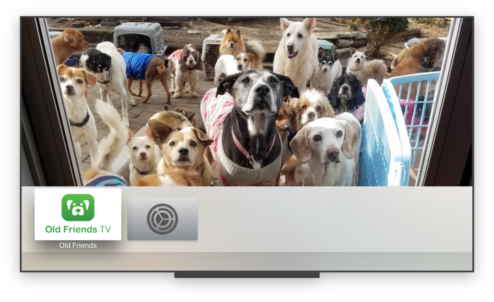
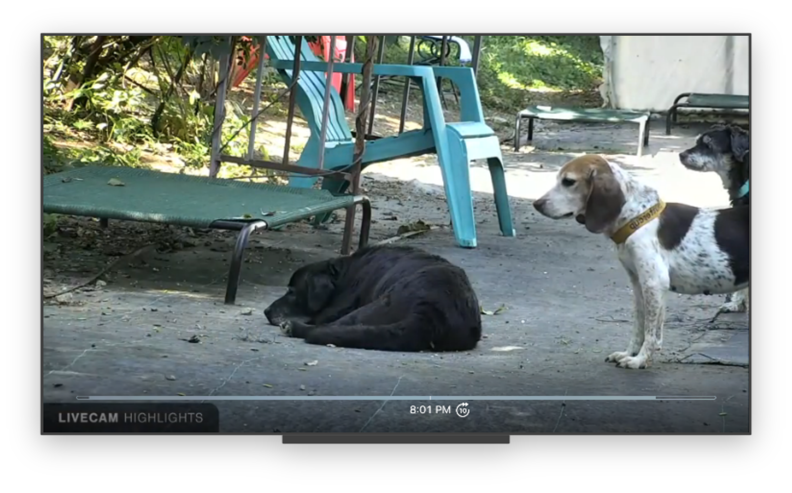
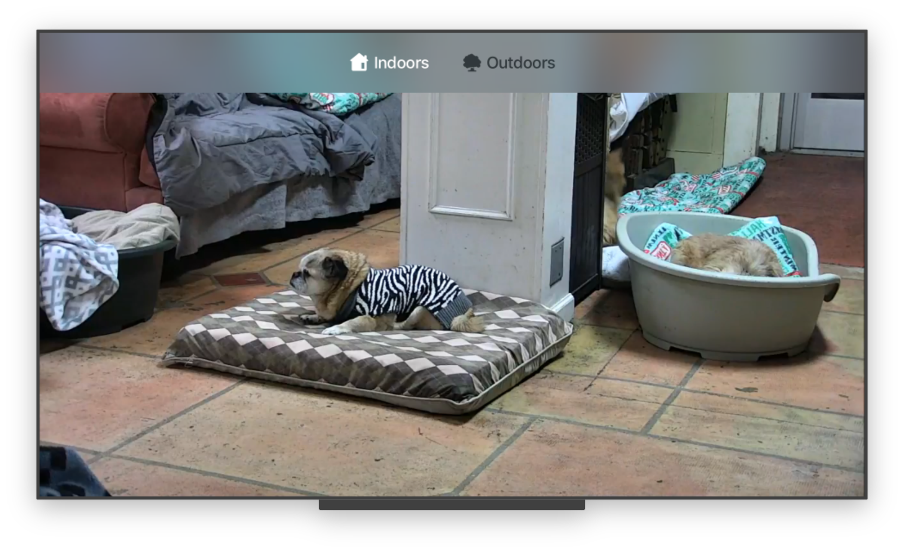

## Old Friends tvOS App

[Old Friends Senior Dog Sanctuary](http://oldfriendsseniordogs.com/index.html) is a Tennessee non-profit that finds homes for senior dogs. They host a [livestream](https://explore.org/livecams/old-friends-senior-dog-sanctuary/senior-dog-gathering-room) of their gardens, featuring over 100 dogs that currently live in the sanctuary. The livestream is nice to put on in the background and leave playing while you work.

This Apple TV app is a wrapper around the live feeds from both indoors and outdoors, and it lets you switch between the two cameras.

  

    
    
    
 
